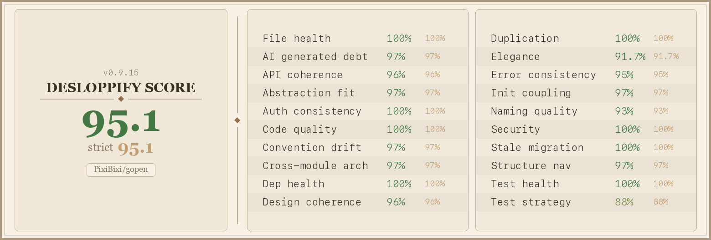

# gopen

[](https://github.com/pixibixi/gopen/actions)
[](https://github.com/pixibixi/gopen/releases)
[](LICENSE)



Open your git repository in the browser at the current branch and directory. Simple, fast, and works with any git platform.

## Features

- 🚀 Opens the browser at the exact location (branch + directory/file)
- 📁 **Open specific files**: Pass a file path as argument
- 🔢 **Line numbers**: Jump to specific line or line range in files
- 🔀 **Multiple remotes**: Choose which remote to open (origin, upstream, fork, etc.)
- 📋 **Clipboard mode**: Copy URL instead of opening browser
- 🔖 **Commit links**: Open a specific commit page or file at a given commit
- 🐚 **Shell completion**: Built-in completion for bash, zsh, and fish
- 🔄 Converts git:// and ssh:// URLs to HTTPS automatically
- 🌐 Supports GitHub, GitLab, Bitbucket, Azure DevOps, Gitea, Gogs, AWS CodeCommit
- 💻 Cross-platform (macOS, Linux, Windows)
- ⚡ Zero dependencies

## Installation

### Quick install (macOS/Linux)

```bash
# Build and install to /usr/local/bin
cd /path/to/gopen
make build
sudo mv gopen /usr/local/bin/
```

### Homebrew (macOS/Linux)

```bash
# Once published to a homebrew tap
brew install pixibixi/tap/gopen
```

### Download pre-built binary

Download the latest release from the [releases page](https://github.com/pixibixi/gopen/releases).

### Docker

```bash
docker run --rm -v $(pwd):/repo -w /repo ghcr.io/pixibixi/gopen:latest
```

Images are available for `linux/amd64` and `linux/arm64` (covers macOS Apple Silicon via Docker Desktop).

### Build from source

```bash
git clone https://github.com/pixibixi/gopen.git
cd gopen
make build
```

## Usage

### Basic usage

```bash
# Open current directory in browser
gopen

# Open a specific file
gopen main.go
gopen src/components/App.tsx

# Open a specific directory
gopen docs/
```

### Advanced options

```bash
# Use a different remote (e.g., upstream, fork)
gopen -r upstream
gopen --remote fork

# Copy URL to clipboard instead of opening
gopen -c
gopen --copy

# Open file at specific line (all syntaxes work)
gopen -l 42 main.go
gopen main.go -l42
gopen --line 100 src/lib/utils.go

# Open file at line range
gopen -l 42-50 main.go
gopen main.go -l 42-50
gopen --line 100-120 src/lib/utils.go

# Combine options
gopen -r upstream -c main.go
gopen --copy src/lib/utils.go
gopen -l 42 -c main.go

# Open a specific commit
gopen --commit abc1234
gopen --commit abc1234 main.go   # file at that commit

# Shell completion
gopen --completion               # auto-detect shell
gopen --completion=zsh           # explicit shell (bash, zsh, fish)

# Show version
gopen -v
gopen --version
```

## Examples

### Basic workflow
```bash
cd ~/projects/my-repo
gopen
# → Opens: https://github.com/user/my-repo/tree/main
```

### Open specific file
```bash
gopen CHANGELOG.md
# → Opens: https://github.com/user/my-repo/tree/main/CHANGELOG.md
```

### Fork workflow
```bash
# Open upstream repository instead of origin
gopen -r upstream
# → Opens: https://github.com/original/repo/tree/main
```

### Copy URL for sharing
```bash
gopen -c src/main.go
# → Output: URL copied to clipboard: https://github.com/user/repo/tree/main/src/main.go
```

### From subdirectory on feature branch
```bash
cd ~/projects/my-repo/src/components
git checkout feature/new-component
gopen
# → Opens: https://github.com/user/my-repo/tree/feature/new-component/src/components
```

### Relative paths
```bash
cd ~/projects/my-repo/docs
gopen ../src/components/App.tsx
# → Opens: https://github.com/user/my-repo/tree/main/src/components/App.tsx
```

### Line numbers
```bash
# Open file at specific line (flexible syntax)
gopen -l 42 main.go
gopen main.go -l42
# → Opens: https://github.com/user/my-repo/tree/main/main.go#L42

# Open file at line range
gopen -l 100-120 src/utils.go
gopen src/utils.go -l 100-120
# → Opens: https://github.com/user/my-repo/tree/main/src/utils.go#L100-L120
```

### Commit links
```bash
# Open the commit page
gopen --commit abc1234
# → Opens: https://github.com/user/repo/commit/abc1234

# Open a file as it was at a specific commit
gopen --commit abc1234 main.go
# → Opens: https://github.com/user/repo/blob/abc1234/main.go

# Copy commit URL to clipboard
gopen --commit abc1234 -c
```

## Git alias (recommended)

Add to your git config for native-style usage:

```bash
git config --global alias.open '!gopen'
```

Then use it like:
```bash
git open
git open main.go
git open -l 42 main.go
git open -r upstream
```

## Shell completion

```bash
# zsh — add to ~/.zshrc
eval "$(gopen --completion=zsh)"

# bash — add to ~/.bashrc
eval "$(gopen --completion=bash)"

# fish — add to ~/.config/fish/config.fish
gopen --completion=fish | source
```

After reloading your shell, `gopen --<Tab>` completes flags and `gopen <Tab>` completes file paths.

## Supported Platforms

| Platform | URL Pattern |
|----------|-------------|
| **GitHub** | `https://github.com/user/repo/tree/branch/path` |
| **GitLab** | `https://gitlab.com/user/repo/-/tree/branch/path` |
| **Bitbucket Cloud** | `https://bitbucket.org/user/repo/src/branch/path` |
| **Azure DevOps** | `https://dev.azure.com/org/project/_git/repo?version=GBbranch&path=/path` |
| **Gitea** | `https://gitea.domain.com/user/repo/src/branch/path` |
| **Gogs** | `https://gogs.domain.com/user/repo/src/branch/path` |
| **AWS CodeCommit** | Console URLs with branch and path |
| **Others** | Falls back to GitHub-style format |

## Supported Git URL Formats

All git URL formats are automatically converted to HTTPS:

```bash
git@github.com:user/repo.git              → https://github.com/user/repo
ssh://git@github.com/user/repo.git        → https://github.com/user/repo
git://github.com/user/repo.git            → https://github.com/user/repo
https://github.com/user/repo.git          → https://github.com/user/repo
```

## Requirements

- Git installed and in PATH
- Go 1.21+ (for building from source)
- **Linux clipboard feature**: `wl-copy` (Wayland), `xclip`, or `xsel`

## Development

### Build and test

```bash
# Build
go build -o gopen .

# Test
go test ./...

# Lint
go vet ./...
staticcheck ./...
```

### Create a release

Releases are cut automatically from [Conventional Commits](https://www.conventionalcommits.org/):

1. Push (or merge) commits to `main` — `feat:` bumps the minor, `fix:` the patch,
   a breaking change the minor while the project is still `0.x`. Every other type
   (`chore:`, `docs:`, `ci:`, `perf:`, `refactor:`, `test:`) releases nothing, so
   mark a change with `fix:` if it needs to ship on its own
2. The `Release` workflow computes the next `vX.Y.Z` and creates the tag
3. In the same run, GoReleaser builds the binaries for all platforms and updates
   the Homebrew tap

Pushing a `v*` tag by hand still triggers the same release path.

## License

MIT
